**Upsilon.Apps.Passkey**
=============================================

**Overview**
------------

This is a C# implementation of a local stored password manager in .Net 10. The application provides a secure way to store and manage passwords locally on the user's device.

**Features**
------------

*   **Password Storage**: Store accounts and services passwords securely
*   **History log**: Log every events
*   **Trigger warnings**: Trigger warnings when detected
*   **Autosave**: Autosave updates
*   **Password Generation**: Generate strong, unique passwords

**Security**
------------

*   **Encryption**: All passwords are encrypted using AES with a set of keys and RSA with a 1024-bit key
*   **Access Control**: Access to the password store is restricted to authorized users only

**Models**

----------

### Class diagram

```mermaid
classDiagram
    direction TB

    %% Main Interfaces
    class ISerializationCenter {
        <<interface>>
        +Serialize~T~(in toSerialize T) string
        +Deserialize~T~(in toDeserialize string) T
    }

    class IClipboardManager {
        <<interface>>
        +RemoveAllOccurence(in removeList IEnumerable~string~) int
    }

    class IPasswordFactory {
        <<interface>>
        +Alphabetic : string
        +Numeric : string
        +SpecialChars : string

        +GeneratePassword(in length int, in alphabet string, in checkIfLeaked bool) string
        +PasswordLeaked(in password string) bool
    }

    class ICryptographyCenter {
        <<interface>>
        +HashLength : int

        +GetHash(in source string) string
        +GetSlowHash(in source string) string
        +Sign(inout source string) void
        +CheckSign(inout source string) bool
        +EncryptSymmetrically(inout source string, in passwords IEnumerable~string~) string
        +DecryptSymmetrically(inout source string, in passwords IEnumerable~string~) string
        +GenerateRandomKeys(out publicKey string, out privateKey string) void
        +EncryptAsymmetrically(inout source string, in key string) string
        +DecryptAsymmetrically(inout source string, in key string) string
    }

    class IItem {
        <<interface>>
        +ItemId : string
        +Database : IDatabase
    }

    class IAccount {
        <<interface>>
        +Service : IService
        +Label : string
        +Notes : string
        +Identifiers : IEnumerable~string~
        +Password : string
        +Passwords : IDictionary~DateTime, string~
        +PasswordUpdateReminderDelay : int
        +Options : AccountOption
    }

    class IService {
        <<interface>>
        +User : IUser
        +ServiceName : string
        +Url : string
        +Notes : string
        +Accounts : IEnumerable~IAccount~
        +AddAccount(in label string, in identifiers IEnumerable~string~, in password string) IAccount
        +AddAccount(in label string, in identifiers IEnumerable~string~) IAccount
        +AddAccount(in identifiers IEnumerable~string~, in password string) IAccount
        +AddAccount(in identifiers IEnumerable~string~) IAccount
        +DeleteAccount(in account IAccount) void
    }

    class IUser {
        <<interface>>
        +Username : string
        +Passkeys : IEnumerable~string~
        +LogoutTimeout : int
        +CleaningClipboardTimeout : int
        +ShowPasswordDelay : int
        +NumberOfOldPasswordToKeep : int
        +WarningsToNotify : WarningType
        +Services : IEnumerable~IService~
        +AddService(in serviceName string) IService
        +DeleteService(in service IService) void
    }

    class IDatabase {
        <<interface>>
        +DatabaseFile : string
        +User : IUser
        +SessionLeftTime : int
        +Logs : IEnumerable~ILog~
        +Warnings : IEnumerable~IWarning~
        +SerializationCenter : ISerializationCenter
        +CryptographyCenter : ICryptographyCenter
        +PasswordFactory : IPasswordFactory
        +ClipboardManager : IClipboardManager
        +WarningDetected : EventHandler~WarningDetectedEventArgs~
        +AutoSaveDetected : EventHandler~AutoSaveDetectedEventArgs~
        +DatabaseSaved : EventHandler
        +DatabaseClosed : EventHandler~LogoutEventArgs~
        +Login(in passkey string) IUser
        +Save(void) void
        +Delete(void) void
        +Close(void) void
        +HasChanged(void) bool
        +HasChanged(in itemId string) bool
        +HasChanged(in itemId string, in fieldName string) bool
        +ImportFromFile(in filePath string) bool
        +ExportToFile(in filePath string) bool
    }

    class ILog {
        <<interface>>
        +DateTime : DateTime
        +Message : string
        +NeedsReview : bool
    }

    class IWarning {
        <<interface>>
        +WarningType : WarningType
        +Logs : IEnumerable~ILog~
        +Accounts : IEnumerable~IAccount~
    }
    
    %% Enums
    class AccountOption {
        <<enumeration>>
        None
        WarnIfPasswordLeaked
    }
    
    class WarningType {
        <<enumeration>>
        LogReviewWarning
        PasswordUpdateReminderWarning
        DuplicatedPasswordsWarning
        PasswordLeakedWarning
    }
    
    class AutoSaveMergeBehavior {
        <<enumeration>>
        MergeAndSaveThenRemoveAutoSaveFile
        MergeWithoutSavingAndKeepAutoSaveFile
        DontMergeAndRemoveAutoSaveFile
        DontMergeAndKeepAutoSaveFile
    }
    
    %% Event Args Classes
    class AutoSaveDetectedEventArgs {
        +MergeBehavior : AutoSaveMergeBehavior
    }
    
    class WarningDetectedEventArgs {
        +Warnings : IEnumerable~IWarning~
    }
    
    class LogoutEventArgs {
        +LoginTimeoutReached : bool
    }
    
    %% Inheritance Relations
    IUser --|> IItem
    IService --|> IItem
    IAccount --|> IItem
    
    %% Link Relations
    IItem --> IDatabase : Database
    IAccount --> IService : Service
    IAccount --> AccountOption : Options
    IService "0" --> "*" IAccount : Accounts
    IService --> IUser : User
    IUser "0" --> "*" IService : Services
    IDatabase --> ISerializationCenter : SerializationCenter
    IDatabase --> ICryptographyCenter : CryptographyCenter
    IDatabase --> IPasswordFactory : PasswordFactory
    IDatabase --> IClipboardManager : ClipboardManager
    IDatabase --> IUser : User
    IDatabase "0" --> "*" IWarning : Warnings
    IDatabase "0" --> "*" ILog : Logs
    IDatabase --> WarningDetectedEventArgs : WarningDetected
    IDatabase --> AutoSaveDetectedEventArgs : AutoSaveDetected
    IDatabase --> LogoutEventArgs : DatabaseClosed
    IWarning --> WarningType : WarningType
    IWarning "0" --> "*" ILog : Logs
    IWarning "0" --> "*" IAccount : Accounts
    AutoSaveDetectedEventArgs --> AutoSaveMergeBehavior : MergeBehavior
    WarningDetectedEventArgs "0" --> "*" IWarning : Warnings
```


**Example Use Cases**

--------------------

### Create a new database

To create a new database, use the `Upsilon.Apps.Passkey.Core.Models.Database.Create` static method.

This method needs an `ICryptographyCenter` implementation, an `ISerializationCenter` implementation, an `IPasswordFactory` implementation and an `IClipboardManager` implementation.
The namespace `Upsilon.Apps.Passkey.Core.Utils` already contains implementations for all of these intefaces except for the `IClipboardManager` which needs an OS specific implementation.

The next parameter is the database file itself, which will be created during the process.

Finally, the method take the username and the passkeys.
Note that the passkeys are used as master passwords to encrypt the database (and the other files).

```csharp
IDatabase database = Upsilon.Apps.Passkey.Core.Models.Database.Create(new Upsilon.Apps.Passkey.Core.Utils.CryptographyCenter(),
   new Upsilon.Apps.Passkey.Core.Utils.JsonSerializationCenter(),
   new Upsilon.Apps.Passkey.Core.Utils.PasswordFactory(),
   new OSSpecificClipboardManager(),
   "./database.pku",
   "username",
   new string[] { "master_password_1", "master_password_2", "master_password_3" });
```

After creation, the method will directly open the database but it will not login directly to the current user.
So to login, check the **Login to an user** use case.

### Open an existing database

To open an existing database, use the `Upsilon.Apps.Passkey.Core.Models.Database.Open` static method.

This method needs an `ICryptographyCenter` implementation, an `ISerializationCenter` implementation, an `IPasswordFactory` implementation and an `IClipboardManager` implementation as in the creation step.

The next parameter is the database file itself and must, obviously, exist.

Finally, the method take the username.

```csharp
IDatabase database = Upsilon.Apps.Passkey.Core.Models.Database.Open(new Upsilon.Apps.Passkey.Core.Utils.CryptographyCenter(),
   new Upsilon.Apps.Passkey.Core.Utils.JsonSerializationCenter(),
   new Upsilon.Apps.Passkey.Core.Utils.PasswordFactory(),
   new OSSpecificClipboardManager(),
   "./database.pku",
   "username");
```

### Login to an user

After opening (or creating) a database, use the `IDatabase.Login` method to login the user.
To do that, call the login method with every passkeys used during the database creation process.
Only the last call of that method, with every correct and ordered passkeys, will return the `IUser` representing the current user successfuly loged in.
Else that method will return `null`.

```csharp
IUser? user = database.Login("master_password_1");	// Will return null
user = database.Login("master_password_2");			// Will also return null
user = database.Login("master_password_3");			// Will return a IUser this time
```

Once the IUser retrieved, it allow a full access to all services and accounts, all log history and all user parameters.

### Saving the changes

Use the `IDatabase.Save` method to save the user's updates.
Note that any update on the user, its services and/or accounts which is not saved will be keeped in a hiden autosave file.

```csharp
user.LogoutTimeout = 5;	// Setting the logout timeout to 5 min will create a hiden autosave file
database.Save();		// Will save the new logout timeout in the database file and remove the autosave file
```

### Logout/Close a database

To logout and close the database, use the `IDatabase.Close` method.
All unsaved updates are stored inside the hiden autosave file.

```csharp
database.Close();
```

**Getting Started**
-------------------

1.  Clone the repository: `git clone https://github.com/YassinLokhat/Upsilon.Apps.Passkey.git`
2. 1. Build the solution for Windows users: `dotnet build Upsilon.Apps.Passkey.Windows.slnx`
2. 2. Build the solution for Linux users: `dotnet build Upsilon.Apps.Passkey.Linux.slnx`

**Contributing**
------------

Contributions are welcome! Please submit a pull request with your changes.

**License**
-------

This project is licensed under the MIT License. See the [LICENSE](LICENSE) file for details.
