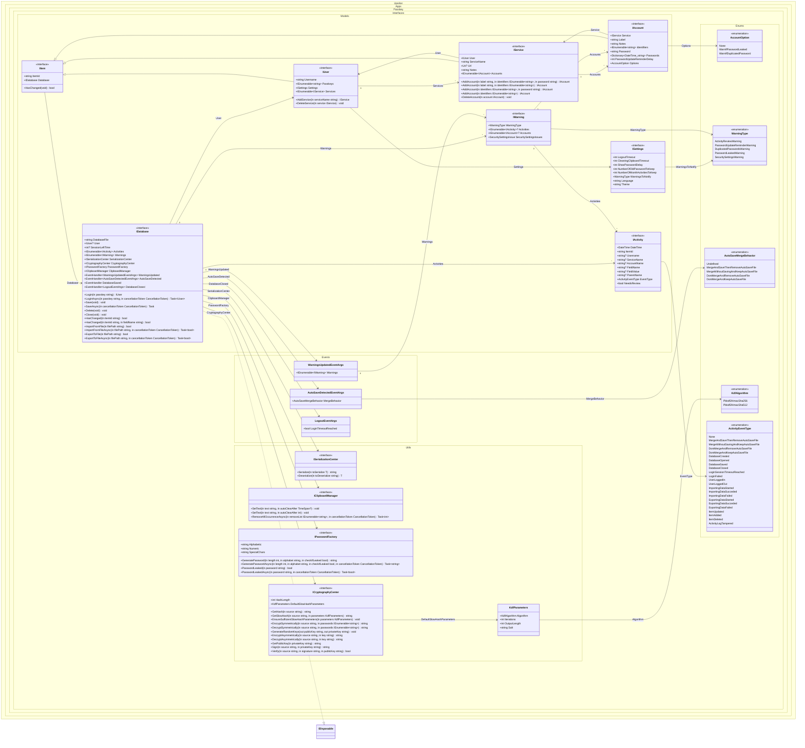

**Upsilon.Apps.Passkey**
=============================================

**Overview**
------------

A local-only password manager written in C# on **.NET 10**. There is no server,
no account, and no synchronization: every secret lives in a single encrypted
`.pku` file on the user's device. Version <!-- BEGIN:versions-overview -->**1.2.0**<!-- END:versions-overview --> (each assembly is versioned
independently; see [SECURITY.md](SECURITY.md) and [`versions.json`](versions.json)).

**Features**
------------

*   **Password storage**: services, accounts, identifiers, notes, and password history
*   **Multi-passkey vault**: ordered master passkeys form an AES-256-GCM onion (see [SECURITY.md](SECURITY.md))
*   **Activity log**: tamper-evident audit trail of vault events
*   **Warnings**: password-update reminders, duplicates, leaks, and activity review
*   **Autosave**: unsaved edits are kept in the `.pku` ZIP and merged on the next login
*   **Password generation**: CSPRNG over a configurable alphabet
*   **Leak detection**: opt-in Have I Been Pwned checks, then XposedOrNot failover, then an optional local HIBP Bloom filter (k-anonymity / offline; see [SECURITY.md](SECURITY.md))
*   **Import / Export**: plaintext JSON (settings + services) or CSV (services only; import accepts comma- or tab-delimited)
*   **WPF client** (Windows): System / Light / Dark theme, QR codes, global paste hotkeys, auto-logout, clipboard cleaning

**Architecture**
----------------

Four layers, two solution files:

```
Interfaces/     Public contracts (IDatabase, IUser, crypto, clipboard, …)
Utils/          Default crypto, JSON, password factory, ProtectedSecret, LeakFilter (.pkbf). Zero NuGet (BCL only).
Core/           Vault implementation. Zero NuGet packages (BCL only).
GUI/WPF/        Windows desktop client (MVVM + a small AppServices locator).
UnitTests/      Core/Utils tests + ViewModel tests (Windows TFM; references the WPF project).
```

| Solution | Projects |
| -------- | -------- |
| `Upsilon.Apps.Passkey.Windows.slnx` | Interfaces, Utils, Core, WPF GUI, UnitTests |
| `Upsilon.Apps.Passkey.Linux.slnx` | Interfaces, Utils, and Core only (no WPF, no tests) |

Core talks to the OS for clipboard only through an injected port
(`IClipboardManager` must be OS-specific). File I/O uses the BCL in Core.
Opt-in HTTP leak checks and the optional offline HIBP Bloom filter live in Utils
(`PasswordFactory`, `Utils/LeakFilter/`). The WPF app supplies
the clipboard implementation and hosts dialogs, session, and navigation behind
`AppServices` so ViewModels stay testable without a window.

**Security**
------------

*   **At rest**: AES-256-GCM onion (HKDF-SHA256 per layer) over ordered passkeys; the activity log uses RSA-4096 hybrid encryption plus a login-time seal. See [SECURITY.md](SECURITY.md).
*   **In memory**: account passwords, passkeys, and the RSA private key are wrapped with `ProtectedSecret` (process-wide AES-GCM) and only revealed just in time.
*   **Session**: configurable auto-logout, clipboard auto-clear (including Windows clipboard history), and progressive login without rollback.
*   **Supply chain**: Core, Utils, and Interfaces refuse any third-party NuGet package at build time. GitHub CodeQL scans production code on CI.

**Models**
----------

### Class diagram

```mermaid
classDiagram
    direction LR

    %% Main Interfaces

    namespace Upsilon.Apps.Passkey.Interfaces.Utils {
        class ISerializationCenter {
            <<interface>>
            +Serialize(in toSerialize T) string
            +Deserialize(in toDeserialize string) T
        }

        class IClipboardManager {
            <<interface>>
            +SetText(in text string, in autoClearAfter TimeSpan?) void
            +SetText(in text string, in autoClearAfter int) void
            +RemoveAllOccurrenceAsync(in removeList IEnumerable~string~, in cancellationToken CancellationToken) Task~int~
        }

        class IPasswordFactory {
            <<interface>>
            +string Alphabetic
            +string Numeric
            +string SpecialChars

            +GeneratePassword(in length int, in alphabet string, in checkIfLeaked bool) string
            +GeneratePasswordAsync(in length int, in alphabet string, in checkIfLeaked bool, in cancellationToken CancellationToken) Task~string~
            +PasswordLeaked(in password string) bool
            +PasswordLeakedAsync(in password string, in cancellationToken CancellationToken) Task~bool~
        }

        class ICryptographyCenter {
            <<interface>>
            +int HashLength
            +KdfParameters DefaultSlowHashParameters
            +GetHash(in source string) string
            +GetSlowHash(in source string, in parameters KdfParameters) string
            +EnsureSufficientSlowHashParameters(in parameters KdfParameters) void
            +EncryptSymmetrically(in source string, in passwords IEnumerable~string~) string
            +DecryptSymmetrically(in source string, in passwords IEnumerable~string~) string
            +GenerateRandomKeys(out publicKey string, out privateKey string) void
            +EncryptAsymmetrically(in source string, in key string) string
            +DecryptAsymmetrically(in source string, in key string) string
            +GetPublicKey(in privateKey string) string
            +Sign(in source string, in privateKey string) string
            +Verify(in source string, in signature string, in publicKey string) bool
        }

        class KdfParameters {
            +KdfAlgorithm Algorithm
            +int Iterations
            +int OutputLength
            +string Salt
        }
    }

    namespace Upsilon.Apps.Passkey.Interfaces.Models {
        class IItem {
            <<interface>>
            +string ItemId
            +IDatabase Database
            +HasChanged(void) bool
        }

        class IAccount {
            <<interface>>
            +IService Service
            +string Label
            +string Notes
            +IEnumerable~string~ Identifiers
            +string Password
            +Dictionary~DateTime_string~ Passwords
            +int PasswordUpdateReminderDelay
            +AccountOption Options
        }

        class IService {
            <<interface>>
            +IUser User
            +string ServiceName
            +Uri? Url
            +string Notes
            +IEnumerable~IAccount~ Accounts
            +AddAccount(in label string, in identifiers IEnumerable~string~, in password string) IAccount
            +AddAccount(in label string, in identifiers IEnumerable~string~) IAccount
            +AddAccount(in identifiers IEnumerable~string~, in password string) IAccount
            +AddAccount(in identifiers IEnumerable~string~) IAccount
            +DeleteAccount(in account IAccount) void
        }

        class IUser {
            <<interface>>
            +string Username
            +IEnumerable~string~ Passkeys
            +ISettings Settings
            +IEnumerable~IService~ Services
            +AddService(in serviceName string) IService
            +DeleteService(in service IService) void
        }

        class ISettings {
            <<interface>>
            +int LogoutTimeout
            +int CleaningClipboardTimeout
            +int ShowPasswordDelay
            +int NumberOfOldPasswordToKeep
            +int NumberOfMonthActivitiesToKeep
            +WarningType WarningsToNotify
            +string Language
            +string Theme
        }

        class IDatabase {
            <<interface>>
            +string DatabaseFile
            +IUser? User
            +int? SessionLeftTime
            +IEnumerable~IActivity~ Activities
            +IEnumerable~IWarning~ Warnings
            +ISerializationCenter SerializationCenter
            +ICryptographyCenter CryptographyCenter
            +IPasswordFactory PasswordFactory
            +IClipboardManager ClipboardManager
            +EventHandler~WarningsUpdatedEventArgs~ WarningsUpdated
            +EventHandler~AutoSaveDetectedEventArgs~ AutoSaveDetected
            +EventHandler DatabaseSaved
            +EventHandler~LogoutEventArgs~ DatabaseClosed
            +Login(in passkey string) IUser
            +LoginAsync(in passkey string, in cancellationToken CancellationToken) Task~IUser~
            +Save(void) void
            +SaveAsync(in cancellationToken CancellationToken) Task
            +Delete(void) void
            +Close(void) void
            +HasChanged(in itemId string) bool
            +HasChanged(in itemId string, in fieldName string) bool
            +ImportFromFile(in filePath string) bool
            +ImportFromFileAsync(in filePath string, in cancellationToken CancellationToken) Task~bool~
            +ExportToFile(in filePath string) bool
            +ExportToFileAsync(in filePath string, in cancellationToken CancellationToken) Task~bool~
        }

        class IActivity {
            <<interface>>
            +DateTime DateTime
            +string ItemId
            +string? Username
            +string? ServiceName
            +string? AccountName
            +string? FieldName
            +string? FieldValue
            +string? ParentName
            +ActivityEventType EventType
            +bool NeedsReview
        }

        class IWarning {
            <<interface>>
            +WarningType WarningType
            +IEnumerable~IActivity~? Activities
            +IEnumerable~IAccount~? Accounts
            +SecuritySettingsIssue SecuritySettingsIssues
        }
    }
    
    %% Enums
    namespace Upsilon.Apps.Passkey.Interfaces.Enums {
        class AccountOption {
            <<enumeration>>
            <<flags>>
            None
            WarnIfPasswordLeaked
            WarnIfDuplicatedPassword
        }
        
        class WarningType {
            <<enumeration>>
            <<flags>>
            ActivityReviewWarning
            PasswordUpdateReminderWarning
            DuplicatedPasswordsWarning
            PasswordLeakedWarning
            SecuritySettingsWarning
        }
        
        class AutoSaveMergeBehavior {
            <<enumeration>>
            Undefined
            MergeAndSaveThenRemoveAutoSaveFile
            MergeWithoutSavingAndKeepAutoSaveFile
            DontMergeAndRemoveAutoSaveFile
            DontMergeAndKeepAutoSaveFile
        }

        class KdfAlgorithm {
            <<enumeration>>
            Pbkdf2HmacSha256
            Pbkdf2HmacSha512
        }

        class ActivityEventType {
            <<enumeration>>
            None
            MergeAndSaveThenRemoveAutoSaveFile
            MergeWithoutSavingAndKeepAutoSaveFile
            DontMergeAndRemoveAutoSaveFile
            DontMergeAndKeepAutoSaveFile
            DatabaseCreated
            DatabaseOpened
            DatabaseSaved
            DatabaseClosed
            LoginSessionTimeoutReached
            LoginFailed
            UserLoggedIn
            UserLoggedOut
            ImportingDataStarted
            ImportingDataSucceded
            ImportingDataFailed
            ExportingDataStarted
            ExportingDataSucceded
            ExportingDataFailed
            ItemUpdated
            ItemAdded
            ItemDeleted
            ActivityLogTampered
        }
    }
    
    %% Event Args Classes
    namespace Upsilon.Apps.Passkey.Interfaces.Events {
        class AutoSaveDetectedEventArgs {
            +AutoSaveMergeBehavior MergeBehavior
        }
        
        class WarningsUpdatedEventArgs {
            +IEnumerable~IWarning~ Warnings
        }
        
        class LogoutEventArgs {
            +bool LoginTimeoutReached
        }
    }

    %% Inheritance Relations
    IUser --|> IItem
    IService --|> IItem
    IAccount --|> IItem
    IDatabase ..|> IDisposable
    
    %% Link Relations
    IItem --> IDatabase : Database
    IAccount --> IService : Service
    IAccount --> AccountOption : Options
    IActivity --> ActivityEventType : EventType
    ICryptographyCenter --> KdfParameters : DefaultSlowHashParameters
    KdfParameters --> KdfAlgorithm : Algorithm
    IService "0" --> "*" IAccount : Accounts
    IService --> IUser : User
    IUser "0" --> "*" IService : Services
    IUser --> ISettings : Settings
    ISettings --> WarningType : WarningsToNotify
    IDatabase --> ISerializationCenter : SerializationCenter
    IDatabase --> ICryptographyCenter : CryptographyCenter
    IDatabase --> IPasswordFactory : PasswordFactory
    IDatabase --> IClipboardManager : ClipboardManager
    IDatabase --> IUser : User
    IDatabase "0" --> "*" IWarning : Warnings
    IDatabase "0" --> "*" IActivity : Activities
    IDatabase --> WarningsUpdatedEventArgs : WarningsUpdated
    IDatabase --> AutoSaveDetectedEventArgs : AutoSaveDetected
    IDatabase --> LogoutEventArgs : DatabaseClosed
    IWarning --> WarningType : WarningType
    IWarning "0" --> "*" IActivity : Activities
    IWarning "0" --> "*" IAccount : Accounts
    AutoSaveDetectedEventArgs --> AutoSaveMergeBehavior : MergeBehavior
    WarningsUpdatedEventArgs "0" --> "*" IWarning : Warnings
```

**Example Use Cases**

--------------------

### Create a new database

To create a new database, use the `Upsilon.Apps.Passkey.Core.Models.Database.Create` static method.

This method needs an `ICryptographyCenter` implementation, an `ISerializationCenter` implementation, an `IPasswordFactory` implementation and an `IClipboardManager` implementation.
The namespace `Upsilon.Apps.Passkey.Utils` already contains implementations for all of these interfaces except for the `IClipboardManager` which needs an OS specific implementation.

The next parameter is the database file itself, which will be created during the process.

Finally, the method take the username and the passkeys.
Note that the passkeys are used as master passwords to encrypt the database (and the other files).

```csharp
IDatabase database = Upsilon.Apps.Passkey.Core.Models.Database.Create(new Upsilon.Apps.Passkey.Utils.CryptographyCenter(),
   new Upsilon.Apps.Passkey.Utils.JsonSerializationCenter(),
   new Upsilon.Apps.Passkey.Utils.PasswordFactory(),
   new OSSpecificClipboardManager(),
   "./database.pku",
   "username",
   new[] { "master_password_1", "master_password_2", "master_password_3" });
```

`CreateAsync` is the same work on a worker thread (RSA-4096 keygen plus one
PBKDF2 stretch per passkey). Prefer it from a UI.

After creation, the method opens the database **and logs the user in**:
`database.User` is already set. Do **not** call `Login` afterwards — that would
append another onion layer on top of an already-complete stack and fail. Progressive
`Login` is only needed after `Open` (see the next use cases).

```csharp
IUser user = database.User!;	// Already logged in after Create
```

### Open an existing database

To open an existing database, use the `Upsilon.Apps.Passkey.Core.Models.Database.Open` static method.

This method needs an `ICryptographyCenter` implementation, an `ISerializationCenter` implementation, an `IPasswordFactory` implementation and an `IClipboardManager` implementation as in the creation step.

The next parameter is the database file itself and must, obviously, exist.

Finally, the method take the username.

```csharp
IDatabase database = Upsilon.Apps.Passkey.Core.Models.Database.Open(new Upsilon.Apps.Passkey.Utils.CryptographyCenter(),
   new Upsilon.Apps.Passkey.Utils.JsonSerializationCenter(),
   new Upsilon.Apps.Passkey.Utils.PasswordFactory(),
   new OSSpecificClipboardManager(),
   "./database.pku",
   "username");
```

After `Open`, `database.User` is still `null` until progressive login succeeds.

### Login to an user

After opening a database, use the `IDatabase.Login` method to login the user.
To do that, call the login method with every passkeys used during the database creation process.
Only the last call of that method, with every correct and ordered passkeys, will return the `IUser` representing the current user successfully logged in.
Else that method will return `null`.

```csharp
IUser? user = database.Login("master_password_1");	// Will return null
user = database.Login("master_password_2");			// Will also return null
user = database.Login("master_password_3");			// Will return a IUser this time
```

**Important — no rollback on a wrong passkey.** Each `Login` call appends the
passkey to the in-memory onion stack. A mistyped value is never undone: further
`Login` calls keep stacking on top of it, so even the correct passkeys will keep
failing until you `Close()` the database and `Open` it again. That is intentional
(an online anti-brute-force friction layer on top of PBKDF2); see
[SECURITY.md](SECURITY.md#progressive-login-without-rollback-online-brute-force-friction).
In the GUI, cancelling the login (e.g. Escape) ends the session so the user can
restart cleanly.

Once the IUser retrieved, it allow a full access to all services and accounts, all log history and all user settings (`user.Settings`).

`IDatabase` also implements `IDisposable`: `Dispose()` closes the session the same
way as `Close()`. Prefer a `using` when you own the lifetime of the database.

### Saving the changes

Use the `IDatabase.Save` method to save the user's updates.
Note that any update on the user, its settings, services and/or accounts which is
not saved is kept in the `autosave` entry inside the `.pku` ZIP (not a separate file).

```csharp
user.Settings.LogoutTimeout = 5;	// Setting the logout timeout to 5 min writes the autosave entry
database.Save();					// Persists into the database entry and clears autosave
```

### Logout/Close a database

To logout and close the database, use the `IDatabase.Close` method.
All unsaved updates remain in the `autosave` ZIP entry until the next successful merge/save.

```csharp
database.Close();
```

### Import and Export

`ImportFromFile` / `ExportToFile` (and their `Async` twins) are routed by file
extension. Only `.json` and `.csv` are supported; any other extension fails.

*   **JSON** carries `Settings` and `Services` (with accounts).
*   **CSV** uses JSON-encoded cells. Import accepts **comma- or tab-delimited**
    rows; export writes **tab-separated** rows. Headers are
    `ServiceName`, `ServiceUrl`, `ServiceNotes`, `AccountLabel`, `Identifiers`,
    `Password`, `AccountNotes`, `AccountOptions`, `PasswordUpdateReminderDelay`.
    Settings are not included in CSV.

Import requires a logged-in user. Export and import files are **plaintext** — see
[SECURITY.md](SECURITY.md#known-limitations). A successful import already
persists (and both import and export save pending dirty state first). Export
fails if the destination file already exists.

### Keeping a UI responsive

Every expensive operation has an `Async` twin: `Database.CreateAsync`,
`Database.OpenAsync`, `IDatabase.LoginAsync`, `SaveAsync`, `ImportFromFileAsync`
and `ExportToFileAsync`.

They matter because the work behind them is deliberately slow: stretching a
single passkey costs about a second by design (see
[SECURITY.md](SECURITY.md#master-passkeys-multi-factor-onion)), and creating a
database also mints an RSA-4096 key pair. Running that on a UI thread freezes
the window for the whole duration.

```csharp
IDatabase database = await Database.OpenAsync(cryptographyCenter,
   serializationCenter,
   passwordFactory,
   clipboardManager,
   "./database.pku",
   "username");

IUser? user = await database.LoginAsync("master_password_1");
user = await database.LoginAsync("master_password_2");
user = await database.LoginAsync("master_password_3");	// Returns the IUser

await database.SaveAsync();
```

Two things to keep in mind:

*   These operations share the progressive passkey stack and the database file,
    so they are not meant to overlap: await one before starting the next.
*   Their events (`AutoSaveDetected`, `DatabaseSaved`, `WarningsUpdated`,
    `DatabaseClosed`) are raised from the worker thread, so a handler touching UI
    state has to marshal back to its own thread.

`IPasswordFactory` follows the same pattern with `GeneratePasswordAsync` and
`PasswordLeakedAsync`. Those two are genuinely asynchronous rather than merely
offloaded: they await the leak-check providers (Have I Been Pwned first, then
XposedOrNot if HIBP is unreachable, then an optional local Bloom filter if both
remote providers fail) instead of blocking a thread on the network.

**Offline leak database (optional)**
------------------------------------

When HIBP and XposedOrNot are both unreachable, Passkey can fall back to a
local Bloom filter built from the HIBP SHA-1 corpus:

*   File: `<exe>/pwned-sha1.pkbf` (~2.4 GiB for the default sizing), or any location set through `FilterPath`
*   Sidecar: `<filter>.pkbf.ranges` (~32 MiB), one fixed-width record per hash-range prefix holding the `ETag` already folded into the filter
*   Config: `LeakFilterConfig` (`Enabled` / `AutoUpdateEnabled` / `FilterPath`) in the WPF host's `config.json` — **application-level**, shared by all vault users (not stored in the `.pku`)
*   Order: HIBP → XposedOrNot → Bloom (if enabled and present) → fail-open
*   Disable never deletes the file; only **Delete offline database** in **App Settings** (or deleting the `.pkbf` manually) removes it — the sidecar goes with it
*   Build / update / enable / delete from **App Settings** (`Ctrl+,`, section **Offline leak database**), or from your own host through `HibpBloomBuilder.RunAsync`
*   **Auto-update** (`AutoUpdateEnabled`, default off): at WPF startup, if offline use is enabled **and** a `.pkbf` already exists, an incremental refresh runs in the background. A missing file never triggers an automatic first build (too heavy for the client).

A full build downloads every HIBP range (~1 048 576 prefixes) and can take several
hours. That is tens of GiB over the wire — brotli/gzip roughly halves the ~78 GB
of raw hex — so the build checkpoints every 4 096 prefixes into the `.building`
pair: an interrupted run resumes from the last checkpoint instead of restarting
the corpus.

An update never rebuilds. `HibpBloomBuildMode.Update` replays every range with
`If-None-Match` against the sidecar's ETags — unchanged ranges answer `304` with
no body — and folds only the changed ones into the existing bit array. This works
because Bloom filters are closed under union and the HIBP corpus only ever grows,
so inserting into the filter already on disk is equivalent to rebuilding it from
the whole corpus. A refresh is therefore dominated by round trips rather than
bytes: every prefix is revalidated, but only a few tens of MiB come down.

Two invariants keep that shortcut safe:

*   A checkpoint snapshots the pending entries, *then* flushes the filter, *then*
    persists the entries. An interruption can only leave the sidecar behind the
    filter, never ahead of it.
*   The sidecar records the `(InsertedCount, BuiltUtc)` stamp of the filter header
    it was written against. A filter that was rebuilt, restored or replaced no
    longer matches, and the sidecar is then rejected: skipping ranges whose bits
    are absent would mean reporting a leaked password as clean.

A rejected sidecar costs a full re-download, never a rebuild.

**WPF client (Windows)**
------------------------

The desktop app lives in `GUI/WPF`. It is MVVM with a small service locator
(`AppServices`) instead of a DI container, so ViewModels stay unit-testable.

*   **Localization**: English + French; app default in `config.json` is `System` (follow OS UI language when a satellite ships), per-user override in User settings. Activity and enum labels are localized at display time (`ActivityViewModel`, `EnumDisplayHelper`).
*   **Import / export UI**: User settings menu — Import (`.json` / `.csv`, comma- or tab-delimited) and Export → JSON / CSV (tab-separated). Success and failure dialogs are generic; the localized reason appears in the Activities grid.
*   **Vault files**: new users go under **App Settings → Default database directory**
    (`DefaultDatabaseDirectory`, default `<exe>/raw`) as `{GetHash(username)}.pku`,
    or another path chosen in the save dialog. Opening by username alone still
    resolves `<exe>/raw/{hash}.pku` (it does not read that setting) — prefer
    `Ctrl+O` or a command-line path when the vault is elsewhere.
*   **Login**: username, then each passkey in order. Escape cancels and closes
    the half-open session (required: there is no passkey rollback). App Settings
    `LoginIdleTimeoutSeconds` (default 5; `0` = off) clears credentials on login-window
    inactivity; the title bar shows the countdown while armed.
*   **Shortcuts**: `Ctrl+O` open, `Ctrl+N` new user, `Ctrl+,` App Settings,
    `Ctrl+P` password generator. While the services window is open,
    **Ctrl+Shift+L** pastes the selected identifier and **Ctrl+Shift+P** pastes
    the selected password into the focused field (copy + synthetic Ctrl+V;
    clipboard still auto-clears).
*   **Offline leak database**: App Settings can build / update / enable / delete
    the local `.pkbf` Bloom filter, and optionally auto-refresh an existing file
    at startup (`AutoUpdateEnabled`; see Offline leak database above).
*   **QR codes**: identifiers and passwords can be shown as a QR matrix generated
    in-process (`Core/Utils/QrCode.cs`, no network). The window closes after
    `ISettings.ShowPasswordDelay` milliseconds when that setting is non-zero.
*   **Theme**: App Settings default (`System` / `Light` / `Dark`, stored in
    `config.json`); each vault user can override it. `System` follows Windows
    light/dark. Light and dark WPF dictionaries plus matching immersive title bars.
*   **Logs**: rolling daily files under `%LocalAppData%\Passkey\logs`.

**Testing**
-----------

### Automated

*   **Core / Utils**: `UnitTests` covers crypto, vault lifecycle, import/export, persistence,
    and related models. Run with `dotnet test` on the Windows solution.
*   **GUI ViewModels**: the same `UnitTests` project also references the WPF app
    and exercises ViewModels (`UnitTests/Gui/`) through a replaceable
    `AppServices` seam and fakes (session, dialogs, clipboard). Import/export tests
    compare localized activity lines via `UnitTestsHelper.FormatImportFailed` /
    `FormatExportFailed` (same path as the WPF Activities grid). No UI automation
    (FlaUI / WinAppDriver): login `PasswordBox`, hotkeys, and themed confirmation
    dialogs (`ThemedMessageBoxView` via `DialogService`) stay out of the automated suite.
*   **Coverage**: `coverage.runsettings` measures **Core only** (Utils is a
    separate assembly and is not in that gate). Windows CI fails the build if
    line coverage drops below **90%**. `run_code_coverage.bat` and Windows CI
    write reports under `_testResult/` (gitignored).

```bash
dotnet test Upsilon.Apps.Passkey.Windows.slnx --settings coverage.runsettings
dotnet test Upsilon.Apps.Passkey.Windows.slnx --filter "FullyQualifiedName~UnitTests.Gui"
```

### Manual smoke (GUI)

After changes that touch login, clipboard, or hotkeys, verify on Windows:

1.  Create a new vault (multi-passkey) and reopen it with the same ordered passkeys.
2.  Mistype a passkey, then close/reopen and log in correctly (progressive login, no rollback).
3.  Copy an account password; confirm the clipboard clears after the configured timeout.
4.  Idle until auto-logout; confirm the session closes and the vault file is released.
5.  Use the Ctrl+Shift paste hotkeys on a focused field (identifier / password).
6.  Show a password as a QR code and confirm the window closes after the configured delay.

**CI**
------

GitHub Actions on `master` and pull requests:

| Workflow | What it does |
| -------- | ------------ |
| `.github/workflows/csharp-dotnet-windows.yml` | Restore, **versions.json sync check**, Debug + Release build, tests with Cobertura, **90% Core line-coverage gate** |
| `.github/workflows/csharp-dotnet-linux.yml` | Restore, **versions.json sync check**, Debug + Release build of the Linux solution (Interfaces + Utils + Core); `dotnet test` with no test projects |
| `.github/workflows/codeql.yml` | CodeQL `security-and-quality` on every push/PR (any branch) and weekly; Release build of production projects (tests excluded) |
| `.github/workflows/release.yml` | On per-component tags (`wpf-v*.*.*`, …; legacy `v*` = WPF): sync check, build/test, `scripts/Sync-Versions.ps1`, GitHub Release (nupkg or WPF zip + SHA-256 + dependency notes) |

Edit [`versions.json`](versions.json), run `.\scripts\Sync-Versions.ps1 -SyncOnly`, then push tags such as `wpf-v1.1.0`. See [CONTRIBUTING.md](CONTRIBUTING.md#cutting-a-release).

Dependabot is configured for the **.NET SDK** only (`dotnet-sdk` ecosystem). Test
NuGet packages (MSTest, FluentAssertions) are not auto-bumped.

**Getting Started**
-------------------

End users: download the Windows x64 zip
(`Upsilon.Apps.Passkey.GUI.WPF-*-win-x64.zip`) from
[Releases](https://github.com/YassinLokhat/Upsilon.Apps.Passkey/releases)
(.NET 10 is bundled; Windows 10 1809 / build 18362 or later).

To build from source:

1.  Clone the repository: `git clone https://github.com/YassinLokhat/Upsilon.Apps.Passkey.git`
2.  Windows (GUI + tests): `dotnet build Upsilon.Apps.Passkey.Windows.slnx` then `dotnet run --project GUI/WPF`
3.  Linux (Interfaces + Utils + Core): `dotnet build Upsilon.Apps.Passkey.Linux.slnx`

Requires the .NET 10 SDK. The WPF app targets `net10.0-windows10.0.18362.0`.

**Contributing**
------------

See [CONTRIBUTING.md](CONTRIBUTING.md) for layout, the zero-dependency policy,
style rules, coverage, and what a PR should include. Security reports go through
[SECURITY.md](SECURITY.md), not public issues.

**License**
-------

This project is licensed under the GNU General Public License v2.0. See the [LICENSE](LICENSE) file for details.
