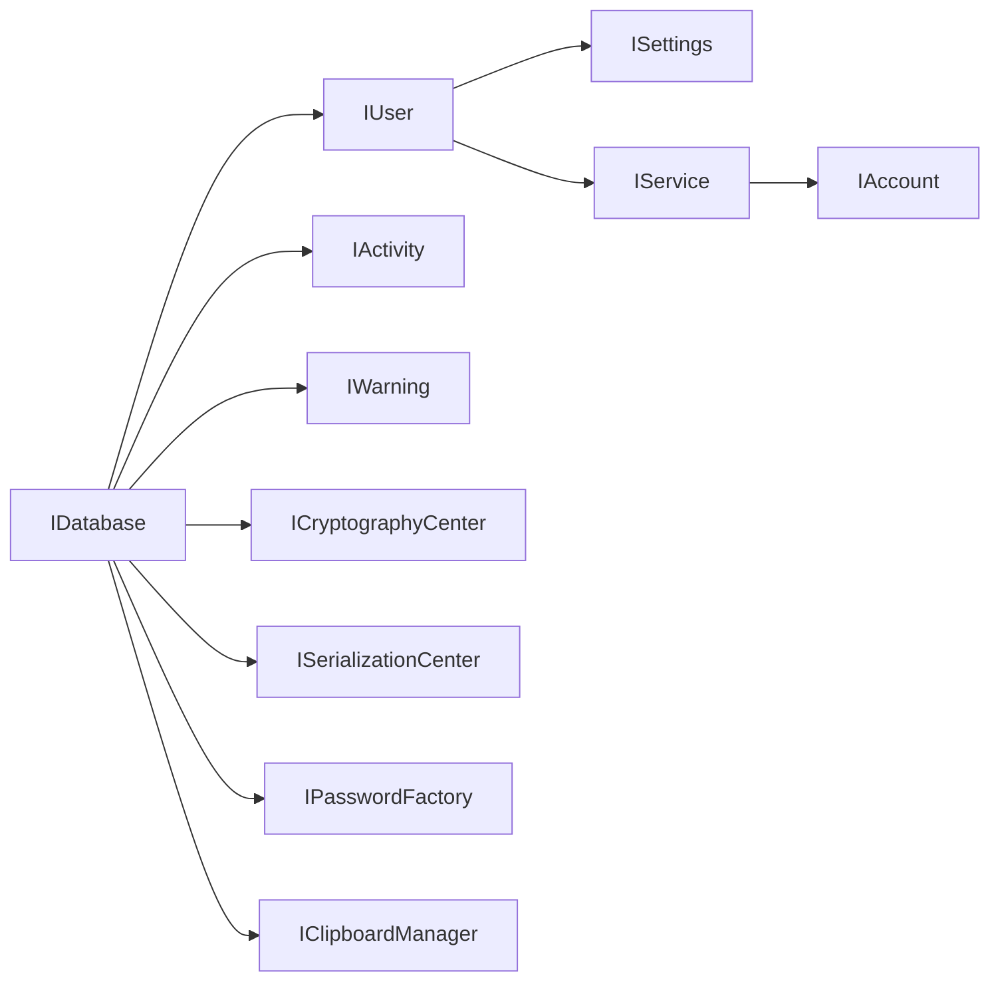
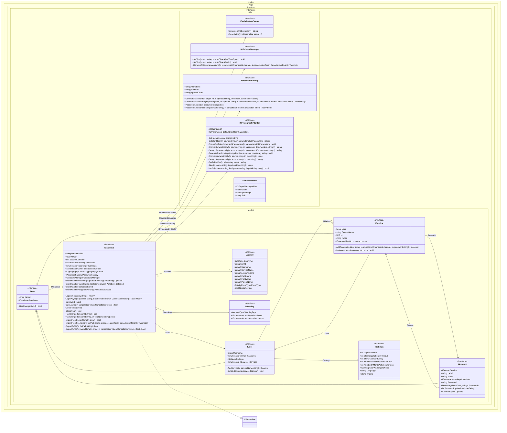

# Architecture

Upsilon.Apps.Passkey is four layers and two solution files. The only **OS-specific** dependency the host must supply is `IClipboardManager`. File I/O lives in Core (BCL). Opt-in HTTP leak checks live in Utils (`PasswordFactory`). Those are not injected ports.

## Repository layout

| Path | Role |
| ---- | ---- |
| `Interfaces/` | Public contracts (`IDatabase`, `IUser`, crypto, serialization, clipboard). |
| `Utils/` | Default implementations: `CryptographyCenter`, `JsonSerializationCenter`, `PasswordFactory`, `ProtectedSecret`. **Zero NuGet packages** (BCL only). |
| `Core/` | Vault implementation: onion encryption, `.pku` I/O, warnings, import/export. **Zero NuGet packages** (BCL only). Vault-internal helpers stay under `Core/Utils/` (`QrCode`, file lock, activity, import/export). |
| `GUI/WPF/` | Windows desktop client (MVVM + a small `AppServices` locator). |
| `UnitTests/` | Core/Utils tests plus ViewModel tests through the `AppServices` seam. |

| Solution | Projects |
| -------- | -------- |
| `Upsilon.Apps.Passkey.Windows.slnx` | Interfaces, Utils, Core, WPF GUI, UnitTests |
| `Upsilon.Apps.Passkey.Linux.slnx` | Interfaces, Utils, and Core only (no WPF, no tests: the test project targets `net10.0-windows`) |

The WPF app supplies `IClipboardManager` and hosts dialogs, session, and navigation behind `AppServices` so ViewModels stay unit-testable without a window.

## Domain graph

`IUser`, `IService`, and `IAccount` implement `IItem` (stable `ItemId`, `HasChanged()`, back-reference to `IDatabase`). `IDatabase` implements `IDisposable`: `Dispose()` closes the session the same way as `Close()`.

## Class diagram

Event-arg types (`WarningsUpdatedEventArgs`, `AutoSaveDetectedEventArgs`, `LogoutEventArgs`) and enums live under `Interfaces.Events` / `Interfaces.Enums` — see the fuller diagram in the repository `README.md`.

## Design choices that show up in usage

* **No DI container in WPF.** `AppServices` is a small locator so tests can swap session, dialogs, clipboard, and navigation.
* **Internal host surfaces.** `Database` is a partial class. Narrow internal hosts (`IActivityHost`, `IAutoSaveHost`, `IUserHost`) keep `ActivityCenter`, `AutoSave`, and `User` from digging into `Database` members (CodeQL `cs/coupled-types`). Public API stays on `IDatabase` / `IUser`.
* **Sticky KDF header** in the `.pku`. Reopen always uses the parameters stored in the file. There is no automatic upgrade to `DefaultSlowHashParameters` on save today. That header is the hook for a future work-factor or algorithm migration. See [[Vault Format]].
* **Deferred ZIP writes** (~500 ms debounce) while logged in. Pre-login audit events (open, failed login) still write immediately so the trail survives a crash before the session starts.
* **Zero-dependency Core, Utils, and Interfaces.** An MSBuild target fails the build if a third-party `PackageReference` appears. Supply-chain surface is the .NET BCL plus CI (CodeQL on GitHub runners). See [[Contributing]].
