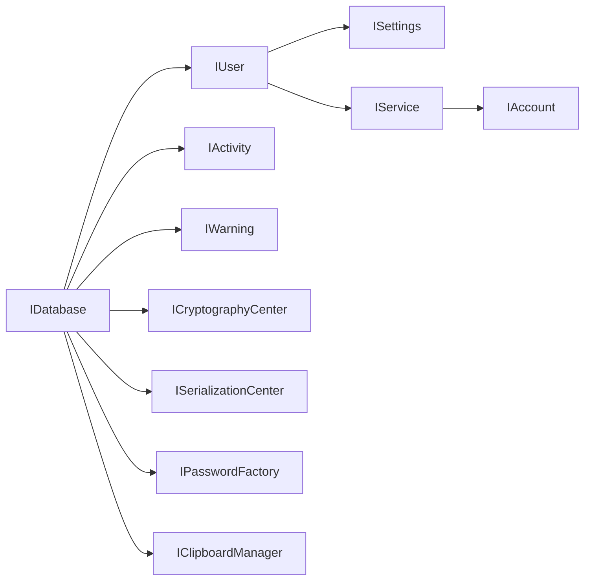

# Architecture

Upsilon.Apps.Passkey is three layers and two solution files. Core never talks to the operating system except through injected ports.

## Repository layout

| Path | Role |
| ---- | ---- |
| `Interfaces/` | Public contracts (`IDatabase`, `IUser`, crypto, serialization, clipboard). |
| `Core/` | Vault implementation: onion encryption, `.pku` I/O, warnings, import/export. **Zero NuGet packages** (BCL only). |
| `GUI/WPF/` | Windows desktop client (MVVM + a small `AppServices` locator). |
| `UnitTests/` | Core tests plus ViewModel tests through the `AppServices` seam. |

| Solution | Projects |
| -------- | -------- |
| `Upsilon.Apps.Passkey.Windows.slnx` | Interfaces, Core, WPF GUI, UnitTests |
| `Upsilon.Apps.Passkey.Linux.slnx` | Interfaces and Core only (no WPF, no tests: the test project targets `net10.0-windows`) |

The port that **must** be OS-specific is `IClipboardManager`. The WPF app supplies that implementation and hosts dialogs, session, and navigation behind `AppServices` so ViewModels stay unit-testable without a window.

## Domain graph

`IUser`, `IService`, and `IAccount` implement `IItem` (stable `ItemId`, `HasChanged()`, back-reference to `IDatabase`). `IDatabase` implements `IDisposable`: `Dispose()` closes the session the same way as `Close()`.

## Class diagram

```mermaid
classDiagram
    direction LR

    namespace Upsilon.Apps.Passkey.Interfaces.Utils {
        class ISerializationCenter {
            <<interface>>
            +Serialize(in toSerialize T) string
            +Deserialize(in toDeserialize string) T
        }

        class IClipboardManager {
            <<interface>>
            +SetText(in text string, in autoClearAfter TimeSpan?) void
            +SetText(in text string, in autoClearAfter int) void
            +RemoveAllOccurrenceAsync(in removeList string[], in cancellationToken CancellationToken) Task~int~
        }

        class IPasswordFactory {
            <<interface>>
            +string Alphabetic
            +string Numeric
            +string SpecialChars
            +GeneratePassword(in length int, in alphabet string, in checkIfLeaked bool) string
            +GeneratePasswordAsync(in length int, in alphabet string, in checkIfLeaked bool, in cancellationToken CancellationToken) Task~string~
            +PasswordLeaked(in password string) bool
            +PasswordLeakedAsync(in password string, in cancellationToken CancellationToken) Task~bool~
        }

        class ICryptographyCenter {
            <<interface>>
            +int HashLength
            +KdfParameters DefaultSlowHashParameters
            +GetHash(in source string) string
            +GetSlowHash(in source string, in parameters KdfParameters) string
            +EnsureSufficientSlowHashParameters(in parameters KdfParameters) void
            +EncryptSymmetrically(in source string, in passwords string[]) string
            +DecryptSymmetrically(in source string, in passwords string[]) string
            +GenerateRandomKeys(out publicKey string, out privateKey string) void
            +EncryptAsymmetrically(in source string, in key string) string
            +DecryptAsymmetrically(in source string, in key string) string
            +GetPublicKey(in privateKey string) string
            +Sign(in source string, in privateKey string) string
            +Verify(in source string, in signature string, in publicKey string) bool
        }

        class KdfParameters {
            +KdfAlgorithm Algorithm
            +int Iterations
            +int OutputLength
            +string Salt
        }
    }

    namespace Upsilon.Apps.Passkey.Interfaces.Models {
        class IItem {
            <<interface>>
            +string ItemId
            +IDatabase Database
            +HasChanged(void) bool
        }

        class IAccount {
            <<interface>>
            +IService Service
            +string Label
            +string Notes
            +IEnumerable~string~ Identifiers
            +string Password
            +Dictionary~DateTime_string~ Passwords
            +int PasswordUpdateReminderDelay
            +AccountOption Options
        }

        class IService {
            <<interface>>
            +IUser User
            +string ServiceName
            +Uri? Url
            +string Notes
            +IEnumerable~IAccount~ Accounts
            +AddAccount(in label string, in identifiers IEnumerable~string~, in password string) IAccount
            +DeleteAccount(in account IAccount) void
        }

        class IUser {
            <<interface>>
            +string Username
            +IEnumerable~string~ Passkeys
            +ISettings Settings
            +IEnumerable~IService~ Services
            +AddService(in serviceName string) IService
            +DeleteService(in service IService) void
        }

        class ISettings {
            <<interface>>
            +int LogoutTimeout
            +int CleaningClipboardTimeout
            +int ShowPasswordDelay
            +int NumberOfOldPasswordToKeep
            +int NumberOfMonthActivitiesToKeep
            +WarningType WarningsToNotify
        }

        class IDatabase {
            <<interface>>
            +string DatabaseFile
            +IUser? User
            +int? SessionLeftTime
            +IEnumerable~IActivity~ Activities
            +IEnumerable~IWarning~ Warnings
            +Login(in passkey string) IUser
            +Save(void) void
            +Close(void) void
            +ImportFromFile(in filePath string) bool
            +ExportToFile(in filePath string) bool
        }

        class IActivity {
            <<interface>>
            +DateTime DateTime
            +string ItemId
            +ActivityEventType EventType
            +string Message
            +bool NeedsReview
        }

        class IWarning {
            <<interface>>
            +WarningType WarningType
            +IEnumerable~IActivity~? Activities
            +IEnumerable~IAccount~? Accounts
        }
    }

    IUser --|> IItem
    IService --|> IItem
    IAccount --|> IItem
    IDatabase ..|> IDisposable
    IItem --> IDatabase : Database
    IAccount --> IService : Service
    IService --> IUser : User
    IUser --> ISettings : Settings
    IService "0" --> "*" IAccount : Accounts
    IUser "0" --> "*" IService : Services
    IDatabase --> IUser : User
    IDatabase "0" --> "*" IWarning : Warnings
    IDatabase "0" --> "*" IActivity : Activities
```

## Design choices that show up in usage

* **No DI container in WPF.** `AppServices` is a small locator so tests can swap session, dialogs, clipboard, and navigation.
* **Sticky KDF header** in the `.pku`. Reopen always uses the parameters stored in the file. There is no automatic upgrade to `DefaultSlowHashParameters` on save today. That header is the hook for a future work-factor or algorithm migration. See [[Vault Format]].
* **Deferred ZIP writes** (~500 ms debounce) while logged in. Pre-login audit events (open, failed login) still write immediately so the trail survives a crash before the session starts.
* **Zero-dependency Core and Interfaces.** An MSBuild target fails the build if a third-party `PackageReference` appears. Supply-chain surface is the .NET BCL plus CI (CodeQL on GitHub runners). See [[Contributing]].
